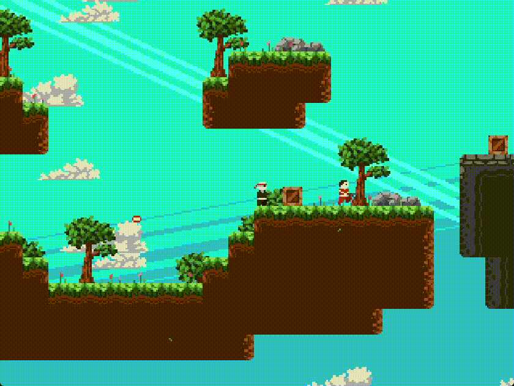
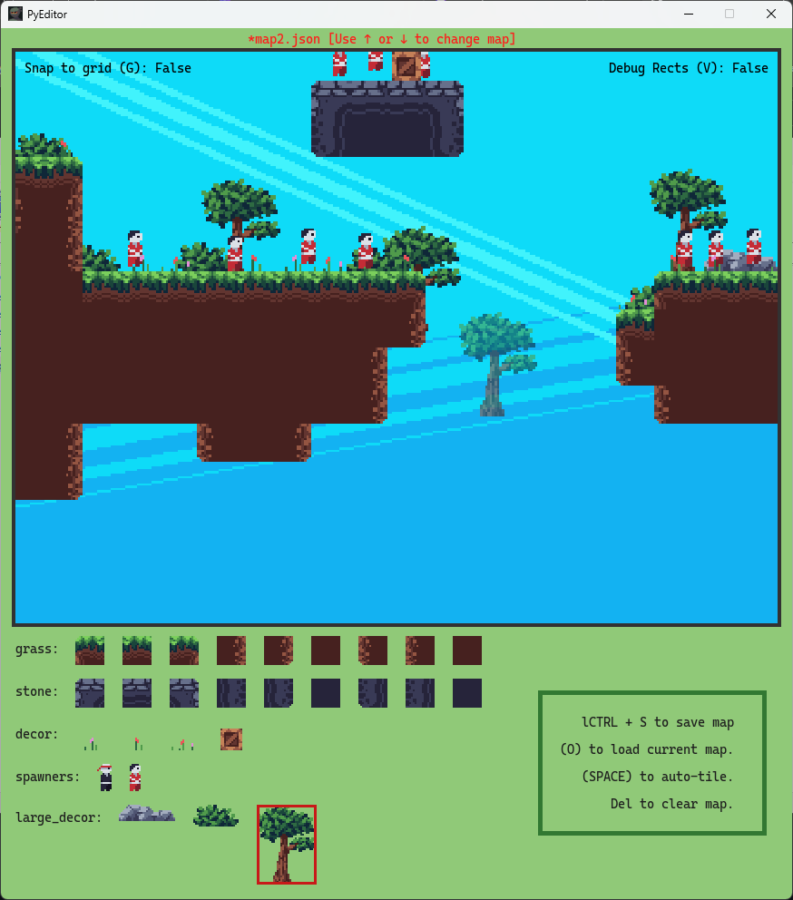

# PyNinja 
Welcome to PyNinja, a 2D pixel art-based game built with Pygame! In this game, you play as a ninja who must navigate through various levels, defeating enemies on its way.

# Features
* **Pixel Art Graphics:** Enjoy retro-style pixel art graphics.
* **Multiple Levels:** Traverse through different levels with increasing difficulty.
* **Smooth Controls:** Use precise controls to move, jump and dash across platforms.
* **Exciting Soundtrack:** Enjoy an engaging soundtrack as you play.
* **Level Editor Support:** Create your own level

### Controls
* **Move Left/Right:** _A_ and _D_
* **Jump:** Spacebar
* **Attack/Dash:** _X_

# Level Editor Features
* Grid and offgrid tiles placement
* Debug view for collision hit-boxes visualisation
* Loading and saving map files as .json
* Auto tiling algorithm for streamlined and efficient level designing

# Screenshots
### Gameplay Features

### Level Editor

# Installation

# Game Assets
* Pixel Art Tile sets, Background Music and Sound Effects: [DaFluffyPotato](https://dafluffypotato.itch.io)
* Font for Level Editor: [CascadiaCode](https://github.com/microsoft/cascadia-code)

